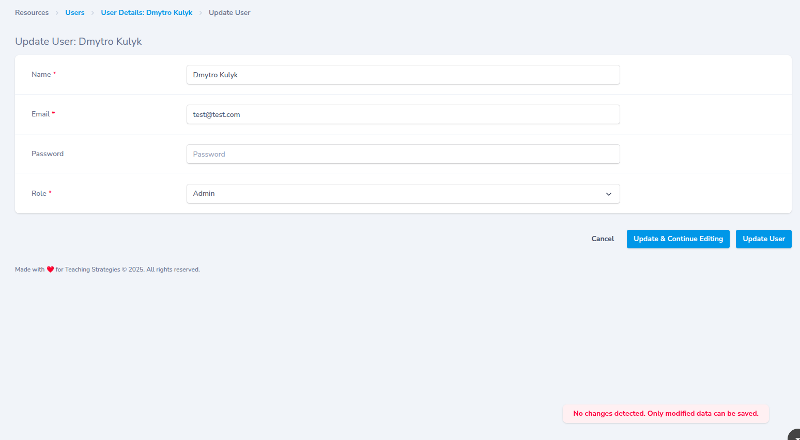

# Nova Validation Toast

Enhanced validation toast messages for Laravel Nova with deduplication and improved error handling. 

This package replaces the generic Nova toast message "there was a problem submitting the form" with actual validation error messages from your server responses, making it easier for users to understand what went wrong.



## Features

- **Error Deduplication**: Prevents duplicate toast messages within a 2-second window
- **Server Error Handling**: Automatically extracts and displays server validation errors
- **Axios Interceptors**: Hooks into Nova's HTTP requests to catch and display errors
- **Configurable**: Easy to extend with additional error patterns
- **Nova 4 & 5 Compatible**: Works with both Nova 4.x and 5.x

## Installation

You can install the package via composer:

```bash
composer require dmkulyk/nova-validation-toast
```

The package will automatically register its service provider.

## Usage

The component automatically activates when Nova boots and enhances the default error handling behavior. No additional configuration is required.

### Customization

If you need to customize the error patterns or behavior, you can publish the JavaScript assets:

```bash
php artisan vendor:publish --tag=nova-validation-toast-assets
```

Then modify the published JavaScript file in `public/vendor/nova-validation-toast/` to suit your needs.

## Configuration

You can modify the `KNOWN_ERRORS` object in the JavaScript to add more error patterns that should be suppressed or handled differently:

```javascript
const KNOWN_ERRORS = {
    formSubmit: 'there was a problem submitting the form',
    // Add more known error strings here as needed
};
```

## How it Works

The component:
1. Intercepts Nova's error handling system
2. Deduplicates error messages to prevent spam
3. Extracts validation errors from server responses
4. Displays clean, user-friendly toast notifications
5. Hooks into both Nova's request system and global axios interceptors

## License

The MIT License (MIT). Please see [License File](LICENSE.md) for more information.