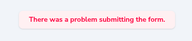
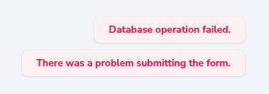

# Nova Validation Toast

Enhanced validation toast messages for Laravel Nova with deduplication and improved error handling.

## 🚨 The Problem

By default, Laravel Nova shows only a generic **"There was a problem submitting the form"** toast message when validation fails. The actual validation error messages are only visible in the browser console, making it difficult for users to understand what went wrong.

## ✅ The Solution

This package intercepts Nova's error handling and displays the actual error messages directly in toast notifications. Now users can see specific validation errors like "Database operation failed" or field-specific validation messages right in the UI, without the second generic toast message.

### Before (Standard Nova Behavior)

*Generic error message that doesn't help users understand what went wrong*

### Problem (Without Package)


*Users see both generic and specific messages, creating confusion*

### After (With Nova Validation Toast)


*Clean, specific error messages that help users understand and fix validation errors*

## ✨ Features

- **🎯 Replaces Generic Messages**: Shows actual validation errors instead of "There was a problem submitting the form"
- **🚫 Error Deduplication**: Prevents duplicate toast messages within a 2-second window  
- **📱 Console to Toast**: Moves validation errors from browser console to user-visible toasts
- **📋 JsonResponse Support**: Displays error messages from JSON responses
- **1️⃣ Single Toast Display**: Shows only one toast per error, preventing message spam
- **🔧 Server Error Handling**: Automatically extracts and displays server validation errors
- **🌐 Axios Interceptors**: Hooks into Nova's requests to catch and display errors
- **⚙️ Configurable**: Easy to extend with additional error patterns
- **✅ Nova 4 & 5 Compatible**: Works with both Nova 4.x and 5.x

## 📦 Installation

You can install the package via composer:

```bash
composer require dmkulyk/nova-validation-toast
```

The package will automatically register its service provider.

## 🚀 Usage

The component automatically activates when Nova boots and enhances the default error handling behavior. No additional configuration is required.

### Customization

If you need to customize the error patterns or behavior, you can publish the JavaScript assets:

```bash
php artisan vendor:publish --tag=nova-validation-toast-assets
```

Then modify the published JavaScript file in `public/vendor/nova-validation-toast/` to suit your needs.

## ⚙️ Configuration

You can modify the `KNOWN_ERRORS` object in the JavaScript to add more error patterns that should be suppressed or handled differently:

```javascript
const KNOWN_ERRORS = {
    formSubmit: 'there was a problem submitting the form',
    // Add more known error strings here as needed
};
```

## 🔧 How it Works

The component:
1. **Intercepts** Nova's error handling system
2. **Deduplicates** error messages to prevent spam
3. **Extracts** validation errors from server responses
4. **Displays** clean, user-friendly toast notifications
5. **Hooks** into both Nova's request system and global axios interceptors

## 📄 License

The MIT License (MIT). Please see [License File](LICENSE.md) for more information.